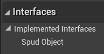
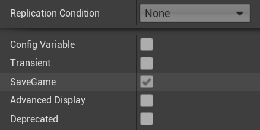
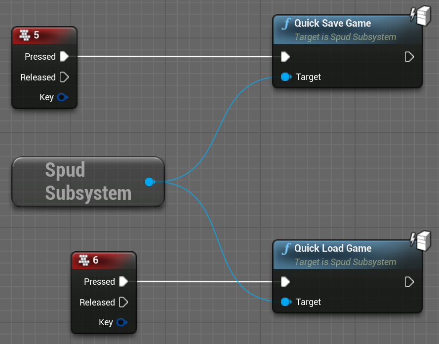

# SPUD: Steve's Persistent Unreal Data library

## What is it?

SPUD is a save game and streaming level persistence solution for Unreal Engine 4.

The 2 main core features:

1. Save / Load game state easily
1. Streamed levels retain their state as they unload / reload without a save needed


Some more details:

* Easily mark actors in your levels as persistent 
  * You implement ISpudObject, a marker interface with no required methods
* Pick properties to save
    * By enabling the "SaveGame" option
* Large number of property types supported, including arrays, references between objects, and custom structs
* You can also manually mark non-level UObjects (e.g. GameInstance) for inclusion in the save
* Dynamically spawned objects that exist at save are re-spawned on load
* Level objects which have been destroyed are automatically re-destroyed on level load
* Core details like transform, controller rotation and physics state are automatically saved
* Usable in C++ or Blueprints


## Examples

This project contains the master documentation for this library, but if you want
to see examples of its use, see the [SPUD Examples](https://github.com/sinbad/SPUDExamples) project.


## Support This Work!!

I've decided to open source this work because I think it's likely to be genuinely 
useful to people. I like sharing my work with others, and that also generally 
makes it better. But, it all takes extra effort over keeping it private!

If you appreciate me doing this, please consider :heart::heart: **[Supporting my work on Patreon!](https://www.patreon.com/stevestreeting)** :heart::heart:
Thanks!

## Installing

### Cloning

The best way is to clone this repository as a submodule; that way you can contribute
pull requests if you want. The project should be placed in your project's Plugins folder.

```
> cd YourProject
> git submodule add https://github.com/sinbad/SPUD Plugins/SPUD
> git add ../.gitmodules
> git commit
```

Alternatively you can download the ZIP of this repo and place it in 
`YourProject/Plugins/SPUD`.

### Referencing in C++

Edit YourProject.Build.cs and do something similar to this:

```csharp
using System.IO;
using UnrealBuildTool;

public class SPUDExamples : ModuleRules
{
	private string PluginsPath
	{
		get { return Path.GetFullPath( Path.Combine( ModuleDirectory, "../../Plugins/" ) ); }
	}
	
	protected void AddSPUD() {
		// Linker
		PrivateDependencyModuleNames.AddRange(new string[] { "SPUD" });
		// Headers
		PublicIncludePaths.Add(Path.Combine( PluginsPath, "SPUD", "Source", "SPUD", "Public"));
	}

	public SPUDExamples(ReadOnlyTargetRules Target) : base(Target)
	{
		PCHUsage = PCHUsageMode.UseExplicitOrSharedPCHs;

		PublicDependencyModuleNames.AddRange(new string[] { "Core", "CoreUObject", "Engine", "InputCore" });
		
		AddSPUD();
	}
}
```

After adding this you should right-click your .uproject file and "Generate Visual
Studio Project Files". 

## Basic Usage


> ### VERY IMPORTANT
>
> You **MUST** save all your levels before playing in editor (PIE). Failure to
> do so results in mis-categorisation of some level objects. The Output Log will
> dump an error about this when unsaved levels are detected. Do not report any bugs 
> unless you've done this!!
> 
> See the menu option **"File -> Save All Levels".**
> 
> Also, see the [FAQ](./doc/faq.md)

The core functionality of SPUD is writing the state of chosen UObjects, including 
a chosen subset of their properties, to a persistent data format so it can be 
saved / loaded and kept consistent across map changes and streaming. 

### Automatically Persisting Actors

Actors present in your world can be picked up automatically. To do this, 
you opt-in your classes by implementing the interface `ISpudObject`. You can
do this in C++:

```c++
class AMyActor : public AActor, public ISpudObject
{
...
```

or in Blueprints:



You don't have to implement any methods on this interface, it is solely a marker
so that SPUD will know to look at your object. Any actor marked this way
will be automatically made persistent. This includes GameModes and GameStates.

### Explicitly Persisting Global Objects

Global objects like GameInstance won't be picked up for persistence even if
you implement `ISpudObject`, because they're not included in the world. However,
you can opt these objects in to persistence so they also get saved:

```c++
	GetSpudSubsystem(GetWorld())->AddPersistentGlobalObjectWithName(this, "MyGameInstance");	
```

Global objects must always exist, SPUD won't re-create them on load, but it will
re-populate their state.

### Pick Properties to Save

Once an object is opted in to being saved, you need to mark the properties of 
the object you want to preserve. You use the "SaveGame" flag to do this.

In C++:

```c++
	UPROPERTY(SaveGame)
	int MySavedInt;
```

or Blueprints, in the advanced property details section:



For the most common case of an object in a level, that's it! 
Many types of property are supported. For more details, see [Properties](./doc/props.md);

### Core State

In addition to properties, SPUD saves some core state automatically on every actor:

* Hidden flag
* Transform (Movable objects only)
* Controller Rotation (Pawns only)
* Physics velocities (Physics objects only)

### Destroyed Actors

If a level actor that implements `ISpudObject` is destroyed, that destruction will 
be made persistent by SPUD. Re-loading a map will automatically re-create that actor, 
but as part of the restore process SPUD will destroy it again, returning the
world to the correct state. You don't need to do anything extra to make this work.

### Runtime Spawned Actors

Actors which are not part of the level but are spawned at runtime, that also
implement `ISpudObject`, will be automatically re-spawned on load.

However, because these objects need to be uniquely identified, you must give
these classes a special FGuid property called `SpudGuid`.

For example:

```c++
	UPROPERTY()
	FGuid SpudGuid;
```

You don't have to assign a value to this property, SPUD will generate a GUID if
it's blank. Also you should **NOT mark it as SaveGame**. It's not your save state,
just some metadata SPUD needs to uniquely identify this object.


## Saving and Loading 

You can call any of the save / load methods on `USpudSubSystem`.

For example quick save/load In Blueprints:


Or in C++:

```c++
auto SpudSystem = GetSpudSubsystem(GetWorld());
SpudSystem->QuickSaveGame();
```

There are many other methods for saving to named slots, listing save games and so on.
When loading a game, the current map will *always* be unloaded, and the game will
travel to the map in the save game (even if it's the same one). This ensures things
are reset correctly before restoring state. For this reason, loading is
asynchronous (see events on USpudSubSystem if you want to listen in on when loading completes).

### A note on streaming 

When it comes to streaming, persistence of level data happens automatically so
long as streaming requests are routed through `USpudSubSystem`, which has
methods to request streamed levels, or to withdraw a request (levels are streamed
out when outstanding requests hit 0).

SPUD comes with a new streaming volume, `ASpudStreamingVolume` to make this
easier to use. But you can call the streaming methods manually as well.

When you travel between maps, SPUD gets notified and will save state to the
active game. 

More information is available in [Levels and Streaming](./doc/levelstreaming.md)


## More details

See [Technical Details](./doc/tech.md)


## License

A library for easy persistence in UE4 which supports saving and loading, and keeping persistent state in objects in streaming levels.

This documentation will be expanded soon!
