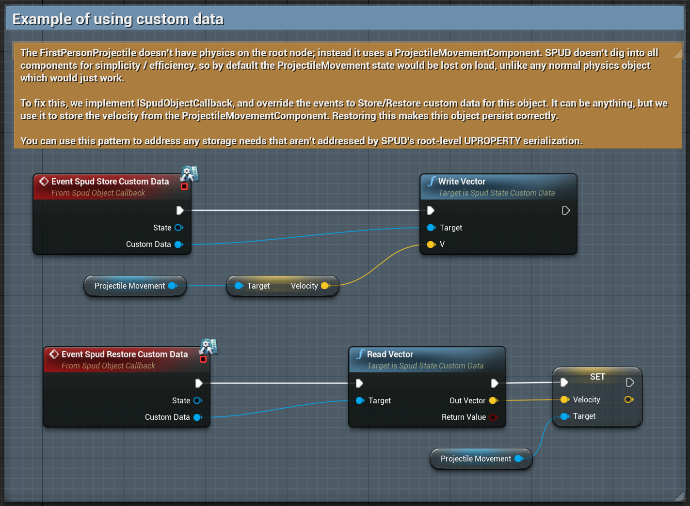

# Properties

## Marking Properties As Persistent

In C++:

```c++
	UPROPERTY(SaveGame)
	int MySavedInt;
```

Blueprints, in the advanced property details section:


## Supported Property Types

The following property types are supported, either as single entries, or
**arrays**.

* Integer (int)
* Integer64 (int64)
* Boolean (bool)
* Float (float)
* Byte (uint8)
* String (FString)
* Name (FName)
* Vector (FVector)
* Rotator (FRotator)
* Transform (FTransform)
* Guid (FGuid)
* Object Reference (Any type of object)

Maps and sets are not supported. 

In addition, any other struct is supported, including custom structs - but 
**not as arrays**. 

## Upgrading Properties

You might add or remove properties over time, and save games might have been taken on
previous versions. That's OK!

SPUD uses a fast restoration path when the property set for a class is the same
as the stored data, but when it's not, a slower path where properties are matched
up by name / type is used instead, so you can still restore data from old saves
even if a new save would have an altered set of properties.

## Root object properties ONLY (not components)

Only properties at the top level of the UObject are persisted. Certain special
cases are handled, such as restoring physics velocities and controller rotation,
but for simplicity and efficiency we do not dig into actor components.

This may be limiting if you use a strongly component-composition based approach.
However adding support for any combination of components, dynamically added
components etc would make everything much more complicated, slower and prone to
more edge cases. 

It's been my observation that UE tends to encourage actor-level specialisation
in most cases anyway, for similar reasons, so I'm sticking with that approach too.

There is a solution to this, however, in the form of Custom Data. 

### Using custom data

If for any reason you have some additional data to store for an object on top
of its top-level properties, you can implement the optional `ISpudObjectCallback`.
This interface gets the opportunity to save / load any custom data it wants, which
is stored with the rest of the object state. 




Custom Data isn't made upgrade-proof like properties, so be careful with this.
You have to read / write custom data the same way. But it allows you to essentially
store anything from anywhere if you can't make it work using a `UPROPERTY` on 
the root object.